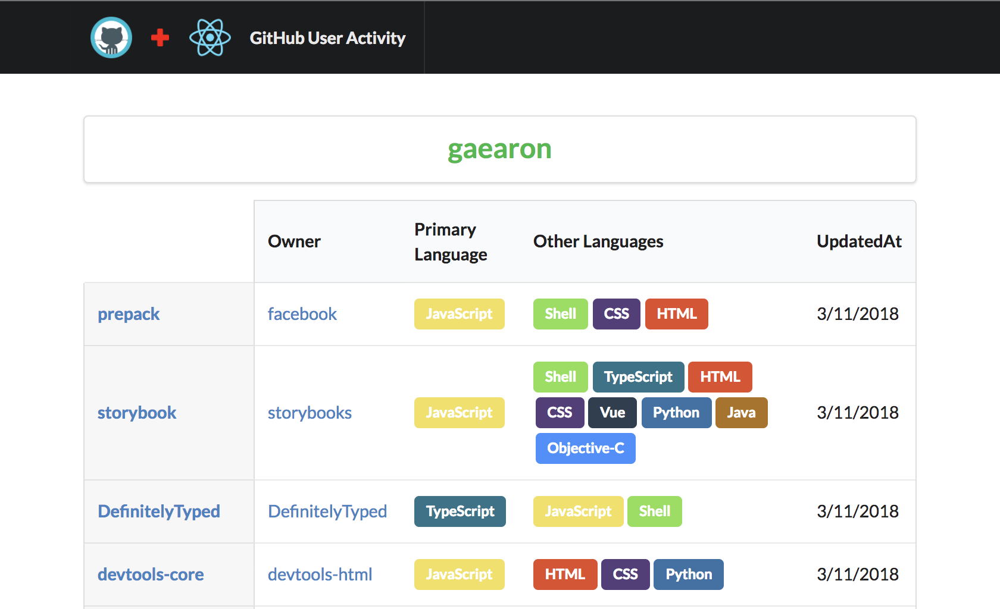
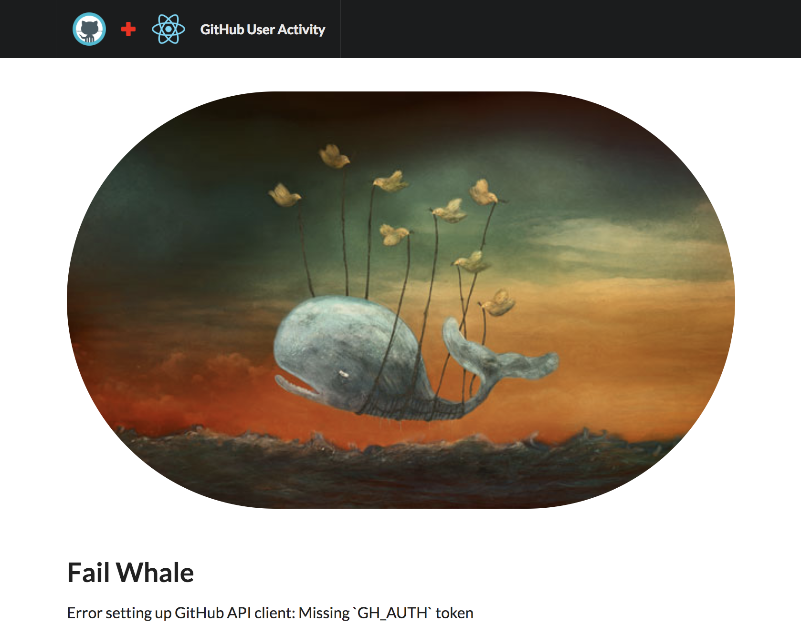

# GitHub User Activity

Shows recent activity of a user by login username.

```console
yarn run start
// http://localhost:3000
```

## Environment Variables

Set the environment variables however you would like, but the easiest for development is to copy over the `.env.example` to `.env`. Env vars are prefixed in accordance with [`create-react-app`](https://github.com/facebook/create-react-app/blob/master/packages/react-scripts/template/README.md#adding-custom-environment-variables). 

| Name | Default | Description |
| :--- | :---: | :--- |
| `REACT_APP_GH_AUTH` | - | Authorization token for fetching from the GH API. Missing token will show error page. |
| `REACT_APP_GH_USER` | "gaearon" | Authorization token for fetching from the GH API. Missing token will show error page. |

## Screen Shots




---

## Flow

This project uses Flow instead of  React PropTypes. I can see runtime typechecking being useful as well, but I value static type checking quite a lot. Flow was just a slight bit easier to get going because CRA already has support in their webpack config. Having something like Flow integrated can stand in place for a lot of simple interface style unit testing.

```console
yarn run flow
yarn run flow:watch
```

## Tests

Tests are very much still a TODO. Just opted to not spend time. When tests are implemented, they might look like the tests [here](https://github.com/rjhilgefort/export-dir).

## Development Notes

I wanted to play with a few different things in this project. Namely, those things were `sanctuary`, `recompose`, `semantic-ui`, and `flow`. In general, I liked working with all of these things, but would go with TypeScript because of the FP support that exists there. I found myself fighting flow a bit.

**Current status** is that there is a table that shows the most recently pushed projects that a user contributes to. See below for TODO.

## TODO

- Tests
- The original plan was to have the other languages be a click event that would pop below each row. After seeing a result set, I didn't think it was really that necessary. I would like to be able to click a row to have additional stats fetched.
- Hook up Redux and have the user be able to be defined via an input. It's currently hardcoded.
- Move from Flow to TypeScript or more aggressive runtime typechecking with `sanctuary-def`.
- Deploy as static site somewhere (deliberately not immediately).